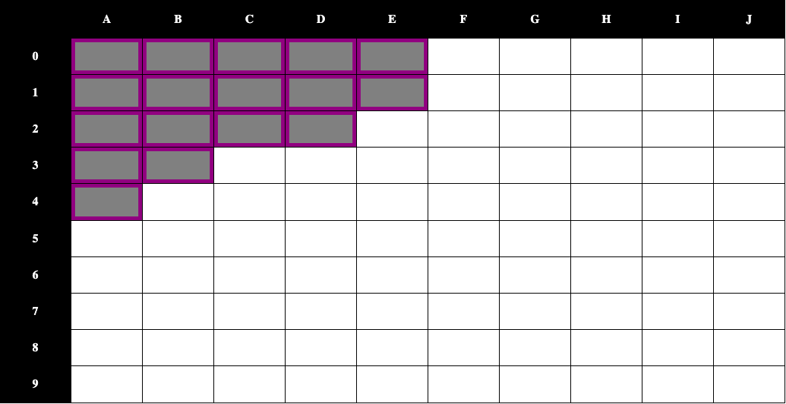
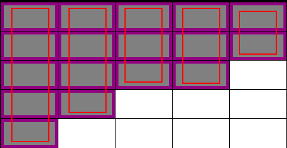
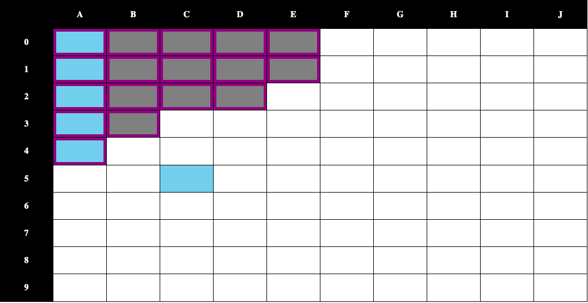
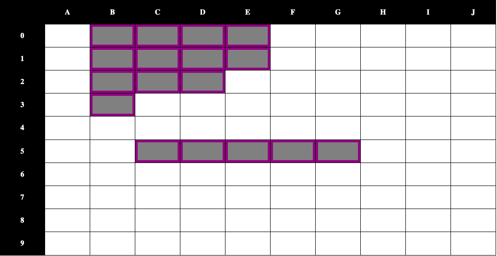
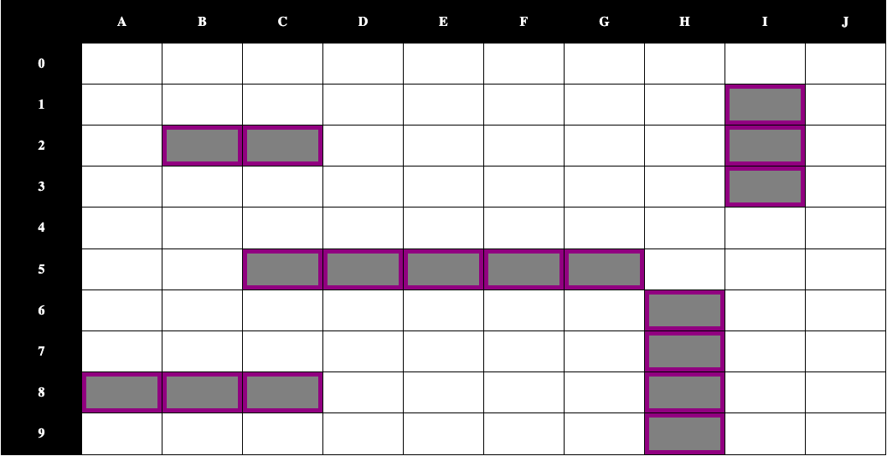
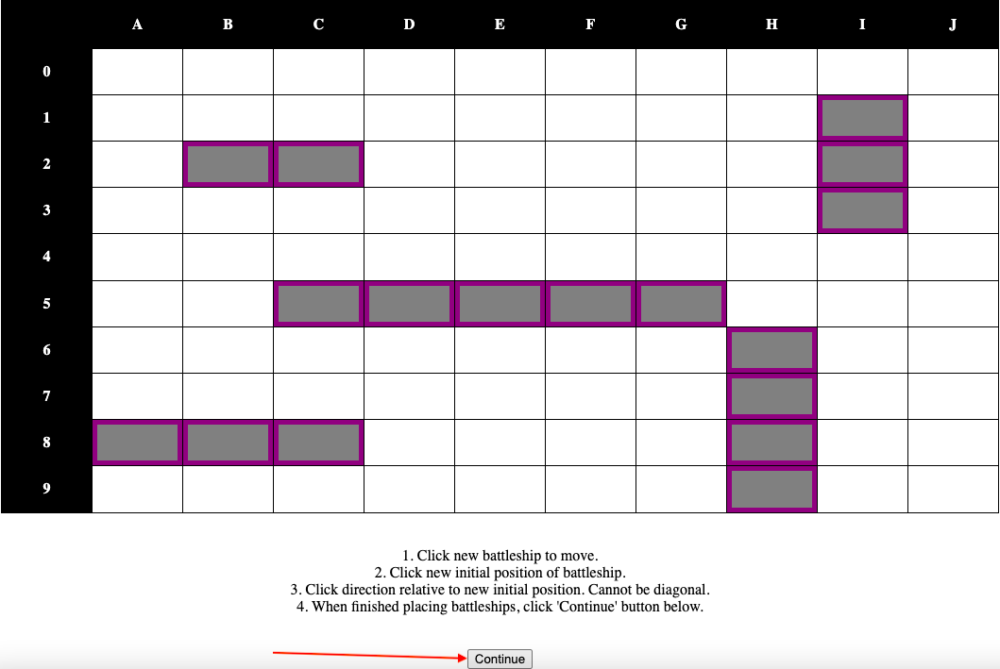
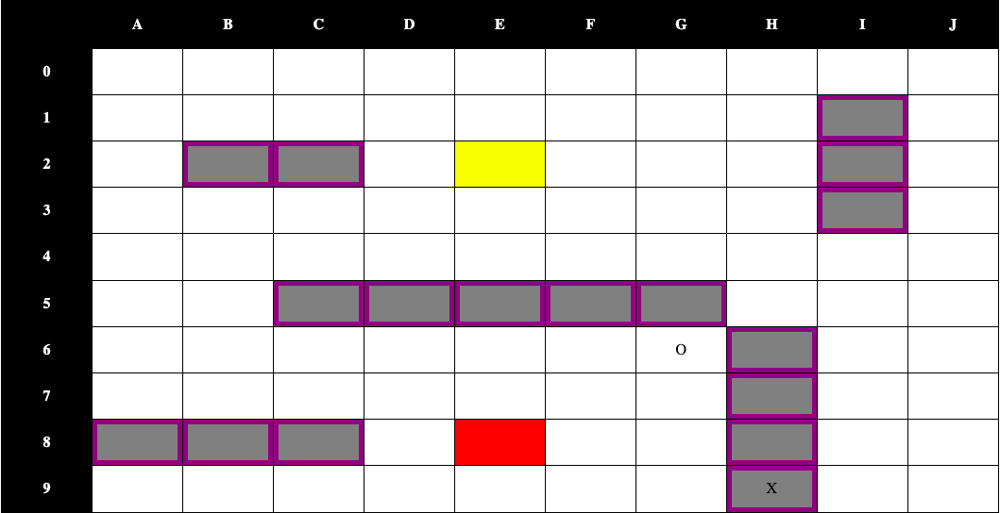
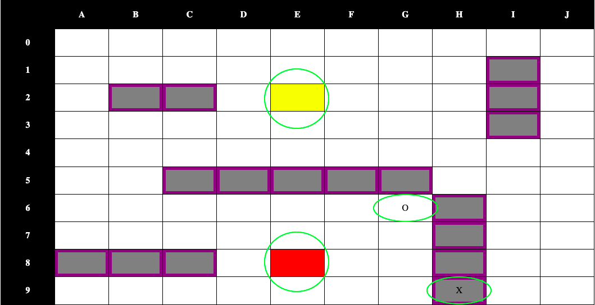
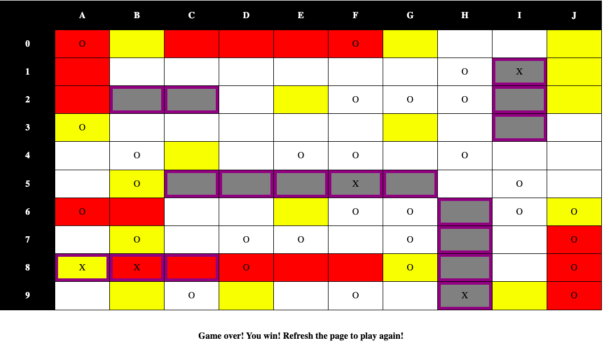

# **Project-Battleship**

Battleship is a game against two players. This game is against the computer.  You are able to move the battleships anywhere on the grid, except diagonally.  Once finished, both players take turns to guess where the opponent's battleships are.  The first player to successfully destroy all of their opponent's battleships is the winner.

## Technologies Used

* HTML
* CSS
* JavaScript

## Getting Started

Click the link below to access the deployed game.

[https://tonyhylo.github.io/Project-Battleship/]

1. The default battleship locations are:
    - A0 - A4
    - B0 - B3
    - C0 - C2
    - D0 - D2
    - E0 - E1

2. To move your battleships around:
    1. Click any cell along the battleship.

    2. Click any available cell that you want to move the battleship to.

    3. Click a direction on either sides of the available cell.  The direction must not be diagonal.

    4. Repeat steps 1-3 until you are satisfied with the battleship placements.

3. Click "Continue" to finish the setup stage.

4. Once a turn, click a cell to guess where the PC battleships are.

5. Status indicators change for each player.  For the user, a yellow cell is a previously guessed miss, and a red cell is a previously guessed hit.  For the PC, an "O" is a previously guessed miss, and a "X" is a previously guessed hit.

6. The game will end when the first player to hit all their opponents battleships.

7. To play again, refresh the browser page.

## Next Steps

* Add an actual restart button
* Introduce different levels of AI.  Currently it is very basic, but introducing an easy/medium/hard level for the PC AI to guess
* A status box on the side to show side-by-side the progress of the game, instead of looking throughout the grid to find sunken battleships
* Click and drag ship positions